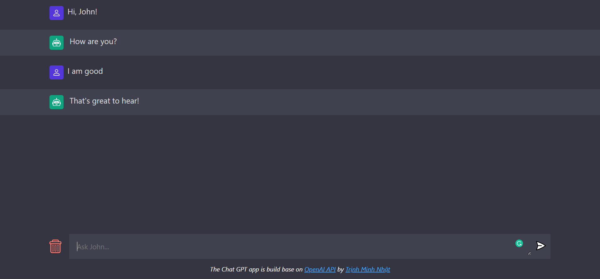

# Chat GPT - OpenAI

The Chat GPT app is build base on OpenAI API.

Live: [**https://vitejs-chat-gpt-open-ai.onrender.com**](https://vitejs-chat-gpt-open-ai.onrender.com)

## 🚀 Technologies Used

- Frontend
  - vite 4.0.x

- Backend
  - express 4.18.x
  - openai 3.1.x

## 🤝 Contributing

If you're interested in contributing to this project, I'd recommend checking out the [`CONTRIBUTING.md`](./.github/CONTRIBUTING.md) document.

## 📖 References

[**JavaScript Mastery**](https://www.youtube.com/watch?v=2FeymQoKvrk)
